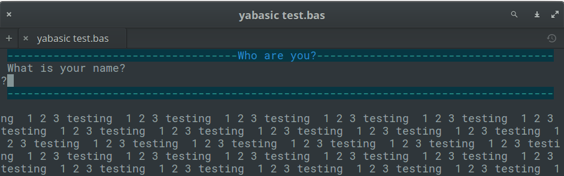
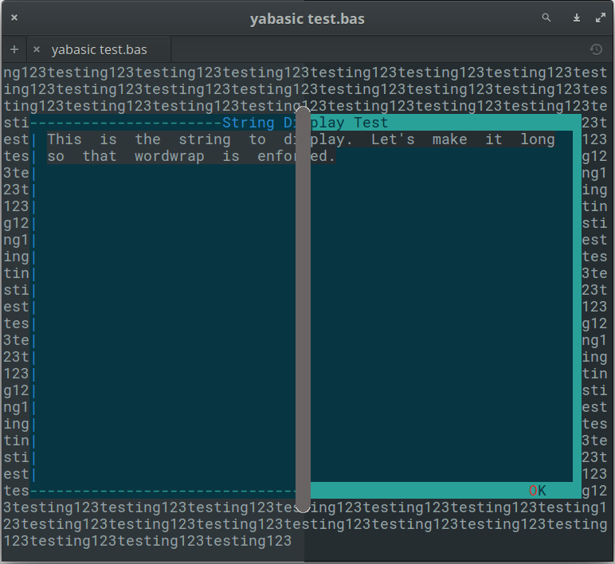
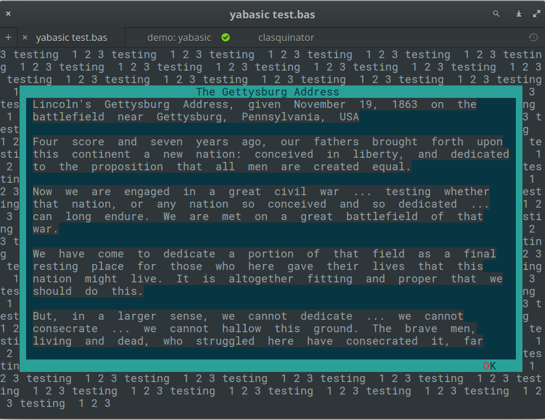
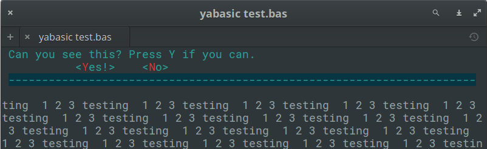

# clasquinator

This folder contains a library for yabasic that allows yabasic to display a variety of dialogs in text mode without making use of external commands.

*Some* routines will perhaps also be made available in graphics mode. Maybe, one day. I am a better text mode programmer, what can I say? 

The library is written as a textmode application and must be run in a terminal. It will not be useful in a headless script.

The entire set of libraries focuses on sane defaults and getting basic functionality into yabasic.

The images below are for illustration only. The exact appearance of the dialogs will depend on your system settings.

Developed on elementary OS 0.4 "Loki" (i.e. Linux), but it should work on any *NIX system that will run yabasic. Testing on Windows has been far more sketchy, since I don't have a windows box here, but I did what I could in my lunch break at work ;-).

The library should exist either in the same folder as your program (symlinks work) or in the standard yabasic library location on your system.

To use the library, use the command 
```
import clasquinatorlib
```
You should **not** use this library and one of the others in this set that provides dialogs concurrently, because they replicate subroutine names. Pick the right one for your program and stick with it!

Unlike the other libraries, you cannot use *\n* to break a line in your text variables. Keep that in mind if compatibility between the libraries is important.

By default, widgets are drawn in <span style="color:cyan; background-color:black">cyan</span>, with button and menu triggers in <span style="color:red; background-color:black">red</span> and the title in <span style="color:blue; background-color:black">blue</span>. But you can override this by setting the GLOBAL variables *menu_colour$*, *title_colour$* and *trigger_colour$*.

The colours available are the normal ones yabasic can handle, namely "black", "white", "red", "blue", "green", "yellow", "cyan" and "magenta" (which can be abbreviated as "bla", "whi", "red", "blu", "gre", "yel", "cya" and "mag" respectively). The library does not check if the two colours are identical, or if they complement each other visually. If you want to make your menus unreadable, more power to you!

The background colour of widgets is always black (well, actually, it is whatever your terminal's default background colour is), but your program's colours will be restored to whatever they were before.

The "buttons" are not mouse-aware.

The first letter of each button or menu item automatically becomes the trigger. Both lower and upper case variants will activate it. It is up to you to ensure that you do not use menu items that start with the same letter. 

*Hint*: You can always number them, e.g.

    menuitem1$ = "1.File"
    
This will make the menu react to the "1" key being pressed, rather than "f" or "F".

If the text of a message (usually in the variable *text$*) is too long to fit in one line, it will be truncated. This may vary with the width of the user's terminal window, so be conservative!

Excessive quote marks (required in other libraries and often supplied by EncloseText$() or \"\") will be removed by the library to maintain compatibility. 

Excessive spaces at the *front and back* of *text$* will be trimmed, but multiple spaces *within* *text$* will be maintained.

This library is currently still in the development stages and not really usable. But watch this space!

## Variables

This library requires a small number of *global* variables. You do not need to initialize them, but don't use the following variable names in your program unless you have a very good reason.

+ *menu_colour$*
+ *title_colour$*
+ *trigger_colour$*
+ *screenheight*
+ *screenwidth*

## External utilities required

I didn't quite manage to get away with writing this library without making *any* system calls. You will need the following commands to be installed on your system.

+ Linux
    + ls
    + grep
    + pwd
    + cut
+ Windows
    + echo
    + cd
    + dir

If you don't have these, your system is broken and you really, really need to reinstall your operating system. So I'm not going to worry about it.

## Routines available:

This library poaches as many ideas as possible from the other four dialog-providing libraries, but there is not 100% compatibility here, so we will not divide things into Common and Clasquinator-specific sections.

+ **ClearDlg**() - on dialog and whiptail, this clears the dialog from your terminal. Same as the yabasic command CLEAR SCREEN, but may work better if you are expecting to issue another Linux command immediately. On zenity, clasquinator and kdialog, dummy routines are provided for compatibility so that you do not need to rewrite your code.

+ **EncloseText$**(thestring$) - A simplified version of the *EncloseString$*() routine that can be found in the *linuxmisclib* library
    + Encloses a string in double quotes, if it isn't already.
    + Therefore *a$ = EncloseText$("This is text")* gives the same result as *a$ = "\"This is text\""*
    + Mostly for use with filenames that may include spaces.

+ **getcmd$**() - returns the command set available.
    + This is really just for me, to stop me from getting confused while I am editing four libraries simultaneously. 
    + However, you could use it to test which utility (or library, in the case of clasquinator) is currently in use and if it is safe to use routines not in the common list.
    + e.g, *if getcmd$() = "clasquinator" SubmenuDlg(options ....)*
    + or  *if getcmd$() = "zenity" ZNotifyDlg("this is a notification")*

+ **GetDirDlg$**(title$, text$, start$) - Select a directory to open.
    + Displays the available directories but requires user to type it in.
    + The value *title$* is the title on top of the widget
    + The value *start$* is the initial directory to start from. If blank or not supplied,this defaults to the current directory.
    + Data entry is CASE-SENSITIVE, but you do not need to type the quote marks supplied for filenames with spaces.
    + Result is returned as a string value with quote marks and extra (leading or trailing) spaces stripped off.
    + An empty string is returned, if there are no existing directories.
    + ONLY available in *clasquinator*, but there are equivalents in *zenity* and *kdialog*.
    + Now works in windows, but there are display bugs to work out.
    + *Example*:
```
a$ = GetDirDlg$("Pick a folder", "Which directory would you like to see?","~")
```


+ **GetDirDlg2$**(title$, text$, start$) - Select a directory to open.
    + Same as GetDirDlg$() but looks different.
    + *Example*:
```
a$ = GetDirDlg2$("Pick a folder", "Which directory would you like to see?","~")
```


+ **GetFileDlg$**(title$, text$, start$) - Select a file to open.
    + Displays the available files but requires user to type it in.
    + The value *title$* is the title on top of the widget
    + The value *start$* is the initial directory to start from. If blank or not supplied,this defaults to the current directory.
    + Data entry is CASE-SENSITIVE, but you do not need to type the quote marks supplied for filenames with spaces.
    + Result is returned as a string value with quote marks and extra (leading or trailing) spaces stripped off.
    + An empty string is returned. if there are no existing files. 
    + ONLY available in *clasquinator*, but there are equivalents in *zenity* and *kdialog*.
    + Now works in windows, but there are display bugs to work out.

+ **GetFileDlg2$**(title$, text$, start$) - Same as GetFileDlg$() but looks different.
    + see *GetDirDlg2$()* for an example.

+ **InputDlg$**(text$, title$, ok$, cancel$) - Presents a one-line dialog into which the user can type a string answer.
    + The value *title$* is the title on top of the widget
    + The values *ok$* and *cancel$* are not used in clasquinator and may be omitted. They are kept in the code for compatibility reasons.
    + ENTER accepts the input, which can also be an empty string.
    + The empty string counts as the equivalent of a cancel button.
    + The result is returned as a string value.
    + *Example:*
```
a$ = InputDlg$("What is your name?", "Who are you?")
```


+ **MakeDirDlg$**(title$, text$, start$) - Create a directory.
    + Same as *GetDirDlg$()* but allows user to type a new filename so that it can be created.
    + Will not allow duplicate filenames to be selected.
    + Now works in windows, but there are display bugs to work out.

+ **MakeDirDlg2$**(title$, text$, start$) - Same as MakeDirDlg$() but looks different.
    + see *GetDirDlg2$()* for an example.

+ **MakeFileDlg$**(title$, text$, start$) - Create a file.
    + Same as *GetFileDlg$()* but allows user to type a new filename so that it can be created.
    + Will not allow duplicate filenames to be selected.
    + Now works in windows, but there are display bugs to work out.

+ **MakeFileDlg2$**(title$, text$, start$) - Same as MakeFileDlg$() but looks different.
    + see *GetDirDlg2$()* for an example.

+ **MenuDlg$**(title$, menustring$, level, mainmenustring$) - Create a one-line menu of options for the user to choose from.
    + The value *title$* is the title on top of the widget.
    + The value *menustring$* is the list of menu options as a single string, separated by hash signs (#). Spaces are allowed.
    + The value *level* can be either 0 for a primary menu or 1 for a submenu.
    + If *level* = 1 *mainmenu$* must also be supplied, otherwise it is not required. This is the *menustring$* of the originating menu.
    + The first letter of menu item automatically becomes the trigger. Both lower and upper case variants will activate it. It is up to you to ensure that you do not use menu items that start with the same letter.
    + Menus will only be displayed to the width of the terminal, so keep them short!
    + Results are returned as a string variable, which will be the trigger in *lowercase*.
    + Submenus can also be created with the *SubMenuDlg$(title$, menustring$)* routine, which is an alias to this one and does not require the *level* parameter.Therefore the following two commands are completely equivalent:
```
MenuDlg$("File menu","Open#Close#Exit",1, "File#Edit#Help")
SubMenuDlg$("File menu","Open#Close#Exit","File#Edit#Help") 
```
+ *Examples:*
```
a$ = MenuDlg$("Main Menu", "File#Edit#Help", 0)
```

```
a$ = MenuDlg$("Help Menu", "Help#About", 1, "File#Edit#Help")
```


+ **MessageDlg**(text$, ok$) - Display a simple message with an OK button.
    + The value *ok$* is the text of the accept button, normally OK.
    + You only have one line to play with, so keep those messages short!
    + Returns nothing, therefore does not actually trap the keypress. But the trigger is highlighted to ensure uniformity among the library's widgets
    + *Example:*
```
MessageDlg("This is a simple message dialog. Close it with ENTER or o.","OK")
```


+ **PasswordDlg$**(text$, title$, ok$, cancel$)
    + Supplied for compatibility purposes, but here it is just an alias for *InputDlg*() - inputs are not obfuscated with asterisks.

+ **RadioDlg$**(title$, menustring$, level, mainmenustring$) - in *clasquinator*, this is an alias to *MenuDlg$()*, provided for compatibility.

+ **StringDisplayDlg**(string$, title$, exit$) - Displays a string in a box in the middle of the screen. 
    + This box will always be three lines from the top and bottom of the terminal and three columns from the left and right. Resing the terminal will count as a keypress in some operating system!
    + *Any* key exits if the string has been completed,or shows the next screen if there is more.
    + The value *title$* is the title on top of the widget.
    + The value *exit$* is the title of the button, normally *OK*.
    + This button is a dummy, just for looks.
    + It works better if you keep your string reasonably short, since there is no escape button if you make the user page through 100 pages!
    + To open up a new line, embed " # " (a hash mark surrounded by spaces) in your string. You can even open up multiple lines with " # # " and so on.
    + Returns nothing
    + *Example:*
```
a$ = "This is the string to display. Let's make it long so that wordwrap is enforced."
StringDisplayDlg(a$, "String Display Test", "OK")
```


+ **SubMenuDlg$**(title$, menustring$, mainmenustring$) - see *MenuDlg$()*.

+ **TestForDialogUtility$**\(\) - Routine to test if the called utility actually exists on the system. An empty string returned means it does, otherwise an error message is returned.
    + in *clasquinator*, this is a dummy routine provided for compatibility. It will always return an empty string.

+ **TextFileDlg**(filename$, title$, exit$) - Displays a text file in a box in the middle of the screen. 
    + This box will always be three lines from the top and bottom of the terminal and three columns from the left and right. Resing the terminal will count as a keypress in some operating system!
    + *Any* key exits if the file has been completed,or shows the next screen if there is more.
    + The value *title$* is the title on top of the widget.
    + The value *exit$* is the title of the button, normally *OK*.
    + This button is a dummy, just for looks.
    + It works better if you keep your file reasonably short, since there is no escape button if you make the user page through 100 pages!
    + This is meant for simple text files. Trying to feed it complex HTML or Markdown documents is not recommended.
    + It is actually better if your text file is not formatted with hard returns. Rather let this routine handle the word wrapping.
    + Returns nothing.
    + *Example:*
```
TextFileDlg("./pg4.txt", "The Gettysburg Address", "OK")
```



+ **WaitDlg**(onoff, text$) - Display a small box with a centred one-line "Please wait" message or anything else that requires no response.
    + Use this while you do something else that may take a while that does NOT involve printing to screen.
    + If you do print, it will be wiped out when you close the dialog.
    + Keep your message short! You only have thirty characters to play with.
    + To display the message, *onoff* should be 1.
    + To remove the dialog, just use *WaitDlg(0)*.
    + Returns nothing.
    + *Example:*
```
WaitDlg(1, "Please wait")	
wait 4 //this is where you would do other stuff
WaitDlg(0)
```


+ **YesNoDlg**(text$,yes$, no$) - Displays a dialog with text (normally a question) and the options to reply yes or no.
    + The first letter of the *yes$* and *no$* variables will become the hotkeys for those buttons, so make sure they are different. Hotkeys are case-insensitive.
    + *no$* is actually a dummy here: pressing anything other than the hotkey for *yes$* will return a no.
    + NOTE: pressing ENTER means NO. If this is not what you want, just swap the labels *yes$* and *no$* around, and *yes$* will become the dummy that is the default on every keypress except the hotkey for *no$*.
    + Returns 1 for yes and 0 for no.
    + If you would rather get the same result in string format, use *YesNoDlg$*(text$,yes$, no$)
    + *Example:*
```
YesNoDlg("Can you see this? Press Y if you can.", "Yes!", "No")
```

