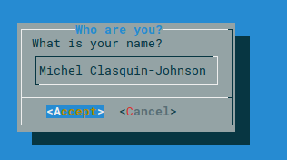
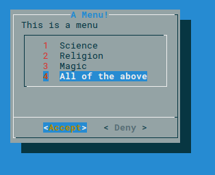
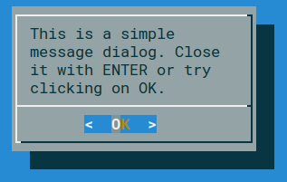
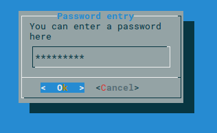
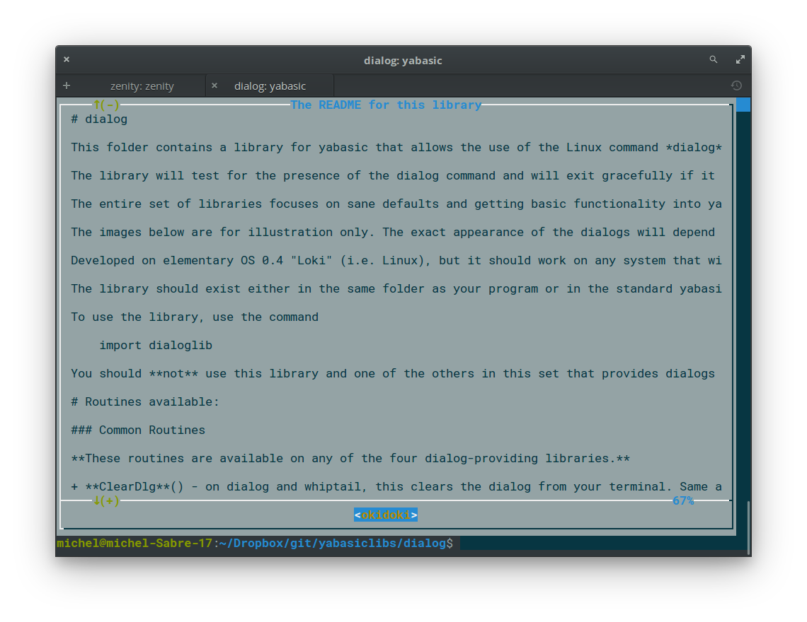
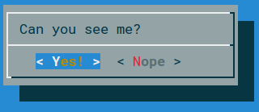
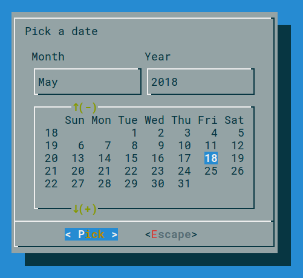

# dialog

This folder contains a library for yabasic that allows the use of the Linux command *dialog* to display a variety of dialogs in text mode.

The library will test for the presence of the dialog command and will exit gracefully if it is not present. dialog is a textmode application and must be run in a terminal. It will not be useful in a headless script.

The entire set of libraries focuses on sane defaults and getting basic functionality into yabasic. There are a lot of options that will not be implemented!

The images below are for illustration only. The exact appearance of the dialogs will depend on your system settings.

Developed on elementary OS 0.4 "Loki" (i.e. Linux), but it should work on any system that will run both yabasic and the dialog command.

The library should exist either in the same folder as your program or in the standard yabasic library location on your system.

To use the library, use the command 

    import dialoglib

You should **not** use this library and one of the others in this set that provides dialogs concurrently, because they replicate subroutine names. Pick the right one for your program and stick with it!

## Routines available:

### Common Routines

**These routines are available on any of the four dialog-providing libraries.**

+ **ClearDlg**() - on dialog and whiptail, this clears the dialog from your terminal. Same as the yabasic command CLEAR SCREEN, but may work better if you are expecting to issue another Linux command immediately.On zenity and kdialog, dummy routines are provided for compatibility so that you do not need to rewrite your code.

+ **InputDlg$**(text$, title$, ok$, cancel$) - Presents a one-line dialog into which the user can type a string answer.
    + The value *title$* is the title on top of the widget
    + The value *ok$* is the text of the accept button, normally OK.MessageDlg("\"This is a simple message dialog. Close it with ENTER or try clicking on OK.\"", "Fine"
    + The value *cancel$* is the text of the reject button, normally Cancel.
    + The result is returned as a string value.
    

+ **MenuDlg**(text$, title$, ok$, cancel$, menustring$) - Create a menu of options for the user to choose from
    + The value *title$* is the title on top of the widget
    + The value *ok$* is the text of the accept button, normally OK.
    + The value *cancel$* is the text of the reject button, normally Cancel.
    + The value *menustring$* is the list of menu options as a single string, separated by hash signs (#). Spaces are allowed.
    + If the number of options exceed the available space in the widget, the list will be scrollable.
    + The result is returned as a numeric value, starting from 1.
    + If you prefer to get the same number in string format, you can use **MenuDlg$**(text$, title$, ok$, cancel$, menustring$)

+ **MessageDlg**(text$, ok$) - Display a simple message with an OK button.
    + The value *ok$* is the text of the accept button, normally OK
    + Returns nothing.

+ **PasswordDlg$**(text$, title$, ok$, cancel$) - Same as *InputDlg$* but with asterisks replacing the input text.
    + The value *title$* is the title on top of the widget
    + The value *ok$* is the text of the accept button, normally OK
    + The value *cancel$* is the text of the reject button, normally Cancel
    + The result is returned as a string value.

+ **RadioDlg**(text$, title$, ok$, cancel$, menustring$, selected$) - Create a menu of options for the user to choose from
    + Same as *MenuDlg*(), except that you can indicate which item in *menustring$* is currently selected or active.
    + The value *title$* is the title on top of the widget
    + The value *ok$* is the text of the accept button, normally OK.
    + The value *cancel$* is the text of the reject button, normally Cancel.
    + The value *menustring$* is the list of menu options as a single string, separated by hash signs (#). Spaces are allowed.
    + The value *selected$* is the currently selected item and must correspond to one of the items in *menustring$* - case sensitive!
    + Just moving the cursor is not enough here - the value in the menu must be explicitly selected with SPACE.
    + If the number of options exceed the available space in the widget, the list will be scrollable.
    + The result is returned as a numeric value, starting from 1.
    + If you prefer to get the same number in string format, you can use **RadioDlg$**(text$, title$, ok$, cancel$, menustring$, selected$)
    + *EXAMPLE: a = RadioDlg("This is a menu", "A Menu!","Accept", "Deny", "Science#Religion#Magic#All of the above", "Magic"): print a*

+ **TestForDialogUtility$**() - Routine to test if the called utility actually exists on the system. An empty string returned means it does, otherwise an error message is returned.

+ **TextFileDlg**(filename$, title$, exit$) - Displays a text file.
    + 	The value *title$* is the title on top of the widget
    + The value *exit$* is the title of the button. Normally EXIT
    + Text wrapping varies from one dialog-provider to the next. It is better if you preformat your text file.
    + Returns nothing

+ **YesNoDlg**(text$,yes$, no$) - Displays a dialog with text (normally a question) and the options to reply yes or no.
    + in *dialog*, the first CAPITAL letter of the yes$ and no$ variables will become the hotkeys for those buttons, so make sure they are different. This does not matter for the other dialog-providing utilities.
    + Returns 1 for yes and 0 for no.

### dialog-specific routines

**These routines will only work with dialog.**

+ **DCalendarDlg$**(text$, ok$, cancel$) - Display a calendar widget with today's date pre-selected.
    + Use TAB and SHFT-TAB to move between the fields.
    + On exit, the date is returned in the form dd/mm/yyyy, e.g. 23/08/2018
    + ONLY available in dialog - for kdialog and zenity, see KCalendarDlg$() and ZCalendarDlg$()
    + DCalendarDlg$ and ZCalendarDlg$ are fully compatible.
    + *EXAMPLE: print DCalendarDlg$("\"Pick a date\"", "Pick", "Escape")*

+ **TransientInfoDlg**(text$)- Display a simple message  that will exit immediately after displaying the message to the user.
    + The screen is not cleared when dialog exits, so that the message will remain on the screen until the calling program clears it later.
    + This is useful when you want to inform the user that some operations are carrying on that may require some time to finish.
    + ONLY available in dialog - it should work in whiptail but doesn't.
	+ Returns nothing.
	+ *EXAMPLE: TransientInfoDlg("\"This will stay onscreen until you press a key\"")*
	

