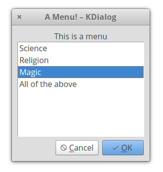
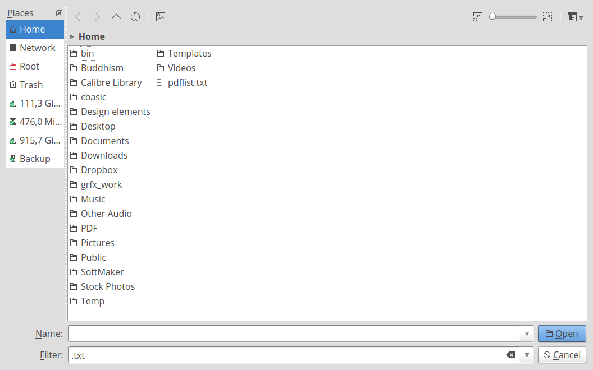

# kdialoglib.yab

A yabasic library (c) Michel Clasquin-Johnson 2018.
Licensed accordingto the MIT license

If you are reading this as a man page, be advised that you can see it in glorious HTML, with pictures even, at https://clasqm.github.io/

This library for *yabasic* allows the use of the Linux  command *kdialog* to display a variety of dialogs in text mode.

The library will test for the presence of the kdialog command and will exit gracefully if it is not present. Kdialog is a KDE program, so the colours and styles will follow that of your KDE defaults. It may also take a moment or two to pop up - there are a lot of libraries to load! If speed is of the essence, stick to the *dialog*, *clasquinator* or *whiptail* libraries.

The entire set of libraries focuses on sane defaults and getting basic functionality into yabasic. There are a lot of options that will not be implemented!

The images below are for illustration only. The exact appearance of the dialogs will depend on your system settings.

Developed on elementary OS 0.4 "Loki" and Lubuntu 18.04 (i.e. Linux), but it should work on any system that will run both yabasic and the kdialog command.

The library should exist either in the same folder as your program or in the standard yabasic library location on your system.

To use the library, use the command 

    import kdialoglib

If you would rather cut and paste these subroutines into your own program rather than importing this rather large library, or create your own, smaller library with just the routines you need, be my guest (I *would* appreciate a note of acknowledgement in your code). But some subroutines require supporting routines that you will find at the end of this library. You will have to include those as well.

You should **not** use this library and one of the others in this set that provides dialogs concurrently, because they replicate subroutine names. Pick the right one for your program and stick with it!

## Routines available:
+ **Common**
    + *ClearDlg*()
    + *EncloseText$*()
    + *getcmd$*()
    + *InputDlg$*()
    + *MenuDlg*()
    + *MessageDlg*()
    + *PasswordDlg$*()
    + *RadioDlg*()
    + *TestForDialogUtility$*()
    + *TextFileDlg*()
    + *YesNoDlg*()
+ **Specific**
    + *KCalendarDlg$*()
    + *KGetDirDlg$*()
    + *KOpenFileDlg$*()
    + *KOpenURLDlg$*()
    + *KSaveFileDlg$*()
    + *KSaveURLDlg$*()

### Common Routines

**These routines are available on any of the four dialog-providing libraries.**

+ **ClearDlg**() - on dialog and whiptail, this clears the dialog from your terminal. Same as the yabasic command CLEAR SCREEN, but may work better if you are expecting to issue another Linux command immediately. On zenity, clasquinator and kdialog, dummy routines are provided for compatibility so that you do not need to rewrite your code.

+ **EncloseText$**(thestring$) - A simplified version of the *EncloseString$*() routine that can be found in the linuxmisclib library
    + Encloses a string in double quotes, if it isn't already.
    + Therefore *a$ = EncloseText$("This is text")* gives the same result as *a$ = "\"This is text\""*
    + Mostly for use with filenames that may include spaces.

+ **getcmd$**() - returns the command set available.
    + This is really just for me, to stop me from getting confused while I am editing four libraries simultaneously. 
    + However, you could use it to test which utility (or library, in the case of *clasquinator*) is currently in use and if it is safe to use routines not in the common list.
    + e.g, *if getcmd$() = "clasquinator" SubmenuDlg(options ....)*
    + or  *if getcmd$() = "zenity" ZNotifyDlg("this is a notification")*

+ **InputDlg$**(text$, title$, ok$, cancel$) - Presents a one-line dialog into which the user can type a string answer.
    + The value *title$* is the title on top of the widget
    + The values *ok$* and *cancel$* have no effect in kdialog and may be omitted, but are kept here for compatibility.
    + The result is returned as a string value.
    + *Example:*
```
a$ = InputDlg$(EncloseText$("What is your name?"), EncloseText$("Who are you?"), "Accept", "Cancel")
```


+ **MenuDlg**(text$, title$, ok$, cancel$, menustring$) - Create a menu of options for the user to choose from
    + The value *title$* is the title on top of the widget
    + The values *ok$* and *cancel$* have no effect in kdialog, but are kept here for compatibility and must be supplied.
    + The value *menustring$* is the list of menu options as a single string, separated by hash signs (#). Spaces are allowed.
    + If the number of options exceed the available space in the widget, the list will be scrollable.
    + The result is returned as a numeric value, starting from 1.
    + The one thing you should be careful not to run from such a menu is ... another Yabasic program. As of May 2020, yabasic scripts or bound apps will crash any shell script or menuing app you try to launch them from. Don't ask me why.
    + If you prefer to get the same number in string format, you can use **MenuDlg$**(text$, title$, ok$, cancel$, menustring$) 


+ **MessageDlg**(text$, ok$)) - Display a simple message with an OK button.
    + The value ok$ has no effect in kdialog, but is kept here for compatibility
    + Returns nothing.
   + *Example:*
```
MessageDlg(EncloseText$("This is a simple message dialog. Close it with ENTER or try clicking on OK."),"OK")
```


+ **PasswordDlg$**(text$, title$, ok$, cancel$) - Same as *InputDlg$* but with asterisks replacing the input text.
    + The value *title*$ is the title on top of the widget.
    + The values *ok$* and *cancel$* have no effect in kdialog and may be omitted, but are kept here for compatibility.
    + The result is returned as a string value.


+ **RadioDlg**(text$, title$, ok$, cancel$, menustring$, selected$) - Create a menu of options for the user to choose from
    + Same as *MenuDlg*(), except that you can indicate which item in *menustring$* is currently selected or active.
    + The value *title$* is the title on top of the widget
    + The values *ok$* and *cancel$* have no effect in kdialog, but are kept here for compatibility and must be supplied.
    + The value *menustring$* is the list of menu options as a single string, separated by hash signs (#). Spaces are allowed.
    + The value *selected$* is the currently selected item and must correspond to one of the items in *menustring$* - case sensitive!
    + If the number of options exceed the available space in the widget, the list will be scrollable.
    + The result is returned as a numeric value, starting from 1.
    + If you prefer to get the same number in string format, you can use **RadioDlg$**(text$, title$, ok$, cancel$, menustring$, selected$)
    + *EXAMPLE: a = RadioDlg("This is a menu", "A Menu!","Accept", "Deny", "Science#Religion#Magic#All of the above", "Magic"): print a*



+ **TestForDialogUtility$**\(\) - Routine to test if the called utility actually exists on the system. An empty string returned means it does, otherwise an error message is returned.

+ **TextFileDlg**(filename$, title$, exit$) - Displays a text file.
    + The value *title$* is the title on top of the widget.
    + The value *exit$* has no effect in kde and may be omitted, but is kept here for compatibility reasons.
    + Text wrapping varies from one dialog-provider to the next. It is better if you preformat your text file.
    + Returns nothing.
    


+ **YesNoDlg**(text$,yes$, no$) - Displays a dialog with text (normally a question) and the options to reply yes or no.
    + in *dialog*, the first letter of the yes$ and no$ variables will become the hotkeys for those buttons, so make sure they are different. This does not matter for the other dialog-providing utilities.
    + Returns 1 for yes and 0 for no.
    + If you would rather get the same result in string format, use *YesNoDlg$*(text$,yes$, no$)


### kdialog-specific routines

**These routines will only work with kdialog, unless specified otherwise.**

+ **KCalendarDlg$**(text$) - Display a calendar widget with today's date pre-selected.
    + On exit, the date is returned in the form Day-of-week Month dd yyyy, e.g Sun Jul 15 2018
    + ONLY available in *kdialog*. For *dialog* and *zenity*, see *DCalendarDlg$()* and *ZCalendarDlg$()*
    + *EXAMPLE: print KCalendarDlg$("\"Pick a date\"")*
    


+ **KGetDirDlg$**(startdir$) - Select a directory to open.
    + If startdir$ = "" it defaults to the HOME directory.
    + Result is returned as a string value.
    + This value is probably terminated with a linefeed - use *StripLFoffSysCmd$()* in the *linuxmisc* library to get rid of it.
    + Also, once you have it you will want to use *EncloseText()* to surround it with double quotes, just in case it has spaces in it.
    + ONLY available in kdialog, but zenity has a comparable set of commands.
    + For an alternative approach, see *SelectDir$()* in the *linuxmisclib* library.

+ **KOpenFileDlg$**(startdir$, filter$) - Select a file to open.
    + If startdir$ = "" it defaults to the HOME directory
    + Filter$ should be formatted like this: *.yab* or *.doc* or *.pdf* - only ONE of these!
    + If filter$ = "" or isw omitted it defaults to all files
    + This will NOT reveal dotfiles like ~/.bashrc
    + Result is returned as a string value
    + This value is probably terminated with a linefeed - use *StripLFoffSysCmd$()* in the *linuxmisc* library to get rid of it. Also, once you have it you will want to use *EncloseText()* to surround it with double quotes, just in case it has spaces in it.
    + ONLY available in *kdialog*, but *zenity* has a comparable set of commands.
    + For an alternative approach, see *SelectFile$()* in the *linuxmisclib* library.
    + *Example:*
```
a$ = StripLFoffSysCmd$(KOpenFileDlg$("", ".txt")
```


+ **KOpenURLDlg$**(startdir$, filter$) - Same as *KOpenFileDlg$()* but result starts with *file://*
    + ONLY available in *kdialog*.

+ **KSaveFileDlg$**(startdir$, filter$) - Select or create a file to save.
    + If startdir$ = "" it defaults to the HOME directory
    + Filter$ should be formatted like this: *.yab* or *.doc* or *.pdf* - only ONE of these!
    + If filter$ = "" or isw omitted it defaults to all files
    + This will NOT reveal dotfiles like ~/.bashrc
    + Result is returned as a string value
    + This value is probably terminated with a linefeed - use *StripLFoffSysCmd$()* in the *linuxmisc* library to get rid of it. Also, once you have it you will want to use *EncloseText()* to surround it with double quotes, just in case it has spaces in it.
    + ONLY available in *kdialog*, but *zenity* has a comparable set of commands.

+ **KSaveURLDlg$**(startdir$, filter$) - same as *KSaveFileDlg$()*, but result starts with *file://*
    + ONLY available in *kdialog*.
