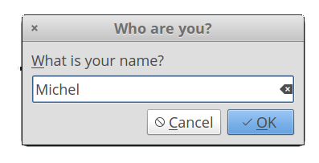
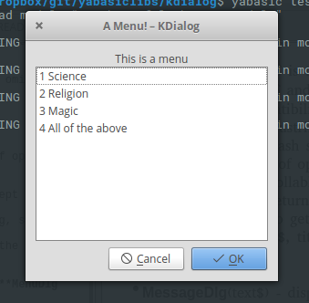
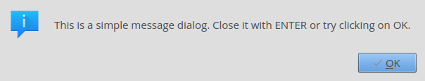
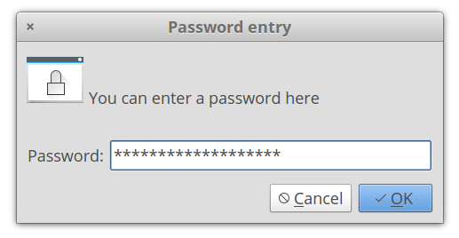
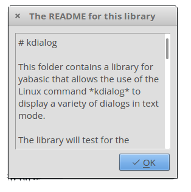
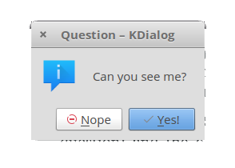
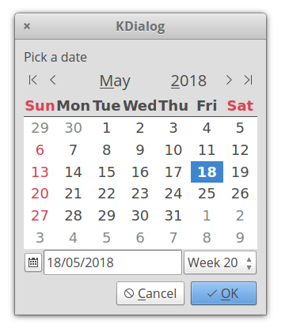

# kdialog

This folder contains a library for yabasic that allows the use of the Linux command *kdialog* to display a variety of dialogs in text mode.

The library will test for the presence of the kdialog command and will exit gracefully if it is not present. Kdialog is a KDE program, so the colours and styles will follow that of your KDE defaults. It may also take a moment or two to pop up - there are a lot of libraries to load! If speed is of the essence, stick to the *dialog* or *whiptail* libraries.

The entire set of libraries focuses on sane defaults and getting basic functionality into yabasic. There are a lot of options that will not be implemented!

The images below are for illustration only. The exact appearance of the dialogs will depend on your system settings.

Developed on elementary OS 0.4 "Loki" (i.e. Linux), but it should work on any system that will run both yabasic and the kdialog command.

The library should exist either in the same folder as your program or in the standard yabasic library location on your system.

To use the library, use the command 

    import kdialoglib

You should **not** use this library and one of the others in this set that provides dialogs concurrently, because they replicate subroutine names. Pick the right one for your program and stick with it!

## Routines available:

### Common Routines

**These routines are available on any of the four dialog-providing libraries.**

+ **ClearDlg**() - on dialog and whiptail, this clears the dialog from your terminal. Same as the yabasic command CLEAR SCREEN, but may work better if you are expecting to issue another Linux command immediately.On zenity and kdialog, dummy routines are provided for compatibility so that you do not need to rewrite your code.

+ **InputDlg$**(text$, title$, ok$, cancel$) - Presents a one-line dialog into which the user can type a string answer.
    + The value *title$* is the title on top of the widget
    + The values *ok$* and *cancel$* have no effect in kdialog and may be omitted, but are kept here for compatibility.
    + The result is returned as a string value.

+ **MenuDlg**(text$, title$, ok$, cancel$, menustring$) - Create a menu of options for the user to choose from
    + The value *title$* is the title on top of the widget
    + The values *ok$* and *cancel$* have no effect in kdialog, but are kept here for compatibility and must be supplied.
    + The value menustring$ is the list of menu options as a single string, separated by hash signs (#). Spaces are allowed.
    + If the number of options exceed the available space in the widget, the list will be scrollable.
    + The result is returned as a numeric value, starting from 1.
    + If you prefer to get the same number in string format, you can use **MenuDlg$**(text$, title$, ok$, cancel$, menustring$) 

+ **MessageDlg**(text$, ok$)) - Display a simple message with an OK button.
    + The value ok$ has no effect in kdialog, but is kept here for compatibility
    + Returns nothing.

+ **PasswordDlg$**(text$, title$, ok$, cancel$) - Same as *InputDlg$* but with asterisks replacing the input text.
    + The value *title*$ is the title on top of the widget.
    + The values *ok$* and *cancel$* have no effect in kdialog and may be omitted, but are kept here for compatibility.
    + The result is returned as a string value.

+ **TestForDialogUtility$**\(\) - Routine to test if the called utility actually exists on the system. An empty string returned means it does, otherwise an error message is returned.

+ **TextFileDlg**(filename$, title$, exit$) - Displays a text file.
    + The value *title$* is the title on top of the widget.
    + The value *exit$* has no effect in kde and may be omitted, but is kept here for compatibility reasons.
    + Text wrapping varies from one dialog-provider to the next. It is better if you preformat your text file.
    + Returns nothing.
    

+ **YesNoDlg**(text$,yes$, no$) - Displays a dialog with text (normally a question) and the options to reply yes or no.
    + in *dialog*, the first letter of the yes$ and no$ variables will become the hotkeys for those buttons, so make sure they are different. This does not matter for the other dialog-providing utilities.
    + Returns 1 for yes and 0 for no.

### kdialog-specific routines

**These routines will only work with kdialog, unless specified otherwise.**

+ **KCalendarDlg$**(text$) - Display a calendar widget with today's date pre-selected.
    + On exit, the date is returned in the form Day-of-week Month dd yyyy, e.g Sun Jul 15 2018
    + ONLY available in kdialog. For dialog and zenity, see DCalendarDlg$() and ZCalendarDlg$()
    + *EXAMPLE: print KCalendarDlg$("\"Pick a date\"")*

