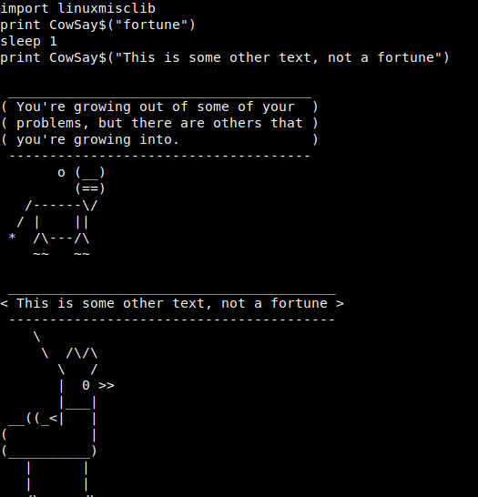
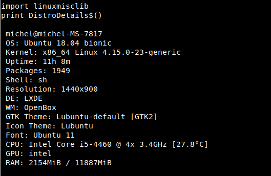
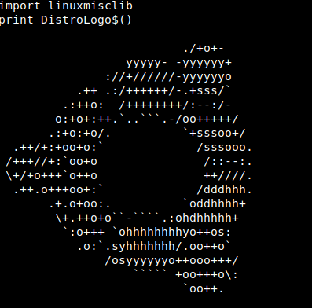

# linuxmisclib.yab

A yabasic library (c) Michel Clasquin-Johnson 2018.
Licensed according to the MIT license.

If you are reading this as a man page, be advised that you can see it in glorious HTML, with pictures even, at https://clasqm.github.io/

This library for yabasic allows the use of a variety of common Linux commands in text mode. For example, opening a text file in the *nano* text editor will make it unnecessary for you to write your own text editing routine.

This library also contains some routines ported from my libraries originally developed under yab for Haiku.

These routines make heavy use of *system()* and *system$()* commands, and some write temporary files, work on them, and read them back. They. will.  slow. your. programs. down. a. lot. Also, ensuring that you (or your users) have the appropriate packages installed will be up to you. The routines themselves only check for the existence of the binary and exit with an error message if it is not found. All I can tell you is that every utility used here was found in the Debian/Ubuntu repositories. *apt-cache search* is your friend.

All routines are case-sensitive.

Developed on elementary OS 0.4 "Loki" and Lubuntu 18.04 (i.e. Linux), but it should work on any system that will run both yabasic and the command in question.

The *yabasic* I use for development is version 2.78.5, compiled and installed from source obtained at www.yabasic.de.

The library should exist either in the same folder as your program (symlinks work, but if you have trouble with binding, just copy the library, it is not THAT big!) or in the standard yabasic library location on your system.

To use the library, use the command

    import linuxmisclib

*before* you start using any of the routines.

See the file *test.bas* for test routines that will show examples of how to use these routines.

It is safe to use this library and ONE of the others in this set concurrently,

----------

## Routines available:

**NOTE:** All routines with the form *ConvertXXX$()*, *OpenXXX$()* or *OpeninXXX$()* will return an empty string if successful or a warning message if the required program is missing. The warning message will only be displayed if you do something like:

    print OpeninTpp$("file.tpp")

(assuming *tpp* is not installed). Or you can test for its presence like this:

    if OpeninTpp$("file.tpp") <> "" {do something}

----------

+ **ArraySort**(a()) - sorts a ONE-dimensional numeric array.
    + Do not try *a() =  ArraySort(a())*, it won't work.
    + Your array should be global - I have had inconsistent results with local arrays.
    + If you prefer, you can use the alias *SortArray()*.
    + **System commands used:** *sort*, *rm*.

+ **ArraySort$**(a$()) - sorts a ONE-dimensional string array (case-independent).
    + Do not try *a$() =  ArraySort$(a$())*, it won't work.
    + Your array should be global - I have had inconsistent results with local arrays.
    + If you prefer, you can use the alias *SortArray$()*.
    + **System commands used:** *sort*, *rm*.

+ **ConvertFile$**(infile$, outfile$) - Convert any [text file format](#pandocformats) to any other format that *pandoc* ( http://pandoc.org ) can handle.
    + Make sure that your two filenames have the correct extension added, then *pandoc* will almost always get it right. 
    + **Example**: *ConvertFile$("myfile.md", "myfile.docx")* will convert a Markdown file to Microsoft .docx format (it does not delete the original file).
    + **NOTE 1**: PDF output requires *pdflatex* or *wkhtmltopdf* to be installed as well as *pandoc*. Rather use *ConvertFile2PDF()* for that. 
    + **NOTE 2**: Also, avoid RTF format output. Pandoc's version of this format seems nonstandard.
    + **System commands used:** *pandoc*.

+ **ConvertFile2PDF$**(infile$, outfile$) - Convert any [text file format](#pandocformats) that *pandoc* ( http://pandoc.org ) can handle to PDF.
    + Make sure that your infile's name has the correct extension added, and that your outfile's name ends with .pdf, then *pandoc* will almost always get it right.
    + **Example**: *ConvertFile2PDF$("myfile.md", "myfile.pdf")* will convert a Markdown file to pdf format. 
    + **System commands used:** *pandoc*, *wkhtmltopdf*

+ **ConvertFile2String$**(infile$) - Convert any [text file format](#pandocformats) that *pandoc* ( http://pandoc.org ) can handle to text.
    + Make sure that your filename has the correct extension, then *pandoc* will almost always get it right.
    + **Example**: *Let a$ = ConvertFile2String$("myfile.md")* will convert a Markdown file and return the result as the string variable a$.  Unlike *ConvertFile$()*, this routine will NOT write an output file. 
    + **System commands used**: *pandoc*.

+ **ConvertImage**(inputfile$, outputfile$) - 
Convert an image file to a different format, optionally with a different filename.
    + This routine will work with either Graphics magic OR Image magic.
    + If both are installed, Graphics magic takes precedence.
    + The output format is taken from the file extension. 
    + The original file is left untouched.
    + Returns 1 for success and 0 for failure
    + **System commands used**: *gm* or *convert*.

+ **CowSay**(text$) - Returns a text spoken by a randomized ASCII cartoon.
    + if *text$* is set as "fortune" then a random short fortune will be selected. Otherwise, the text you gave is printed.
    + **System commands used**: *cowsay*, *fortune*.
    + *Example:*
````
print CowSay$("fortune")
sleep 1
print CowSay$("This is some other text, not a fortune")
````


+ **Define$**(word$) - Get a dictionary definition of a word.
    + This requires the installation of the *dict* program AND at least one dict dictionary, for example *dict-gcide*.
    + The more dictionaries you add, the more results you can expect.
    + This command searches localhost only and does not go online to *dict.org*.
    + **System commands used**: *dict*.

+ **DistroDetails$**() - Return your distro's and computer's stats .
    + **System commands used**: *screenfetch*.
    + *Example:*
```
print DistroDetails$()
```


+ **DistroLogo$**() - Return your distro's logo in monochrome ASCII art format.
    + **System commands used**: *screenfetch*.
    + *Example:*
```
print DistroLogo$()
```


+ **EncloseString$**(thestring$,type) - Enclose a string in either single or double quotes, if it isn't already.
    + Mostly for use with long filenames that may include spaces. No error-checking is done here.
    + If you feed this routine a string that already contains quotes, your program will come to a halt. Use INSTR() to check for that first. 

    + *type* is either
        + 0 (single quote) or
        + 1 (double quote).
    + **System commands used:** none.

+ **FileDedupe$**(infile$,outfile$) - Remove duplicate lines from a text file *infile$* and write the results to *outfile$*.
    + Any existing *outfile$* will be overwritten!
    + Will fail if *infile$* and *outfile$* are identical.
    + For best results your filename should be enclosed in single quotation marks so that it will not get confused by spaces. This routine will not check for that.
    + If you prefer, you can use the alias *DedupeFile$()*.
    + Returns nothing.
    + **System commands used:** *awk*.

+ **FileExists**(fullpathname$) - Test if a file exists.
    + Returns 1 if the file exists, or returns 0 if the file does not exist.
    + If only a filename is given, only the program's local directory will be searched.
    + But you can also give a full pathname.
    + **System commands used:** none.

+ **FileorDir**(fullpathname$) - Test if a file (in the Unix sense) is a regular file or a directory. 
    + **Returns** 
        + 1 if it is a directory, 
        + 0 if it is just a regular file.
    + **System commands used:** *test*.

+ **FileorLink**(fullpathname$) - Test if a file (in the Unix sense) is a regular file or a symbolic link.
    + **Returns** 
        + 1 if it is a link, 
        + 0 if it is just a regular file. 
    + This does NOT test for hard links. 
    + **System commands used:** *test*.

+ **FileSort$**(infile$,outfile$) - Sort a text file *infile$* and write the results to *outfile$*.
    + Any existing *outfile$* will be overwritten!
    + Will fail if *infile$* and *outfile$* are identical.
    + For best results your filename should be enclosed in single quotation marks so that it will not get confused by spaces. This routine will not check for that.
    + If you prefer, you can use the alias *SortFile$()*.
    + Returns nothing if succesful, otherwise returns an error message.
    + **System commands used:** *sort*.

+ **GetEnvVar$**(var$)
    + Get an environment variable
    + Shortcut to *peek$("env",  "NAME")*
    + Do *not* precede the value *var$* with the $ character as you would do in bash.
    + Inspired by a library by Martin Medvold
    + *Example: *a$ = GetEnvVar$("PATH")*

+ **IsFileZeroByte**(pathname$) - determines if a passed filename is a zero-byte file.
    + **Returns** 
        + 0 (false) if the passed variable is larger than zero bytes, 
        + 1 (true) if it is zero bytes in size
        + note that this reverses the output of the *test -s* command.
    + **Caution:** will also return 1 if file does not exist: test for that with *FileExists* first.
    + It will also return 0 if file is actually a directory: test for that with *FileorDir* first.
    + If the file given is a symlink, this routine will report on the real, linked file.
    + This yabasic routine is incompatible with a similar routine I wrote for yab. If you program in both languages, you need to reverse the conditions.
    + **System commands used:** *test*.

+ **IsItATextFile**(filename$) - Tests whether a given file is a text file or not. 
    + Anything that does not have the string "text" in the results of the *file* command is assumed to be a binary file. This should work fine on Linux but may be problematic on BSD systems (including MacOS?) where this command may reject shell scripts. 
    + If you need something more powerful than *file*, I suggest you install *enca*. 
    + **System commands used:** *file*.

+ **KillPlay**() - Stops any multimedia files currently playing.
    + Stops playing of multimedia files if they use either *ffplay* or *aplay*, such as files launched with 
        + *PlayMP3()*, 
        + *PlayVideo()* or 
        + *PlayWav()*. 
    + Please note that this is a nuclear option: it will also affect any other programs making use of these utilities.
    + **System commands used:** *pkill*.

+ **NotifyDlg**(text$, duration, block) - Pop up a one-line notification.
    + If *duration* is 0, the notification remains on screen until *right*-clicked, and displays an [X] button to mark the fact.
    + Otherwise, there is no button and the  notification disappears after the specified number of seconds.
    + If *block* equals 0 the notification will launch in a new process and your yabasic program can continue.
    + If *block* equals 1, your app will pause until the popup disappears.	
    + Keep your notifications short - you don't have much space to play with.
    + Returns nothing
    + **System utility used:** *dzen2*


+ **OpenAbook$**() - Opens the *abook* text-mode contact manager.
    + Only the default database is provided for in this routine.
    + **System commands used:** *abook*.

+ **OpenBastet$**() - Opens the *bastet* CLI Tetris clone.
    + **System commands used:** *bastet*.

+ **OpenCalcurse$**() - Opens the *calcurse* text-mode calendar app. Only the default calendar is provided for in this routine. 
    + **System commands used:** *calcurse*.

+ **OpenGtypist$**() - Open the gtypist tying tutor program.
    + **System commands used:** *gtypist*

+ **OpenHnb$**() - Open the *hnb* hierarchical notebook.
    + Only the default database is provided for in this routine.
    + **System commands used:** *hnb*

+ **OpenInDav$**(filename$) - opens a given text file in the *dav* text editor in the same terminal window as your program. 
    + Will fail and return an error message if *dav* does not exist on your system. 
    + If *filename$* does not exist, *dav* will create one in memory and let you save it. 
    + If *filename$* is an empty string (""), *dav* will open with a new, unnamed file. (You can also use the shortcut *OpenDav$*() for this).
    + For best results your filename should be enclosed in single quotation marks so that it will not get confused by spaces. This routine will not check for that.
    + You may have to CLEAR SCREEN and rebuild your screen afterwards.
    + **System commands used:** *dav*.

+ **OpeninDhex$**(filename$)
    + opens a given file in the *dhex* hexadecimal editor.
    + Must be run in a program that is already in a terminal.
    + For best results your filename should be enclosed in single quotation marks so that it will not get confused by spaces. This routine will not check for that.
    + **System commands used:** *dhex*.

+ **OpeninElinks$**(URL$}: Opens a URL in the *elinks* text-based browser. 
    + Must be run in a program that is already in a terminal. 
    + Will fail and return an error message if *elinks* does not exist on your system. 
    + For best results your URL should be enclosed in single quotation marks so that it will not get confused by spaces. This routine will not check for that. 
    + **System commands used:** *elinks*.

+ **OpeninFbless$**(file$) - Opens a .FB2 ebook in the *fbless* ebook reader
    + .FB2 is an obscure format these days, but you can convert .EPUBs and so on on sites like [https://www.online-convert.com]
    + Must be run in a program that is already in a terminal.
   + For best results your URL should be enclosed in single quotation marks so that it will not get confused by spaces. This routine will not check for that.
   + **System commands used:** *fbless*.

+ **OpeninHte$**(filename$)
    + opens a given file in the *hte* hexadecimal editor.
    + The package name for this utility might be "ht" on your system.
    + This routine forces hte into hex mode even if it is a text file, but you can explore the other modes with F6.
    + Must be run in a program that is already in a terminal.
    + For best results your filename should be enclosed in single quotation marks so that it will not get confused by spaces. This routine will not check for that.
    + **System commands used:** *hte*.

+ **OpeninHexcurse$**(filename$)
    + opens a given file in the *hexcurse* hexadecimal editor.
    + Must be run in a program that is already in a terminal.
    + For best results your filename should be enclosed in single quotation marks so that it will not get confused by spaces. This routine will not check for that.
    + **System commands used:** *hexcurse*.

+ **OpenInJed$**(filename$) - opens a given text file in the *jed* text editor in the same terminal window as your program. 
    + Will fail and return an error message if *jed* does not exist on your system. 
    + If *filename$* does not exist, *jed* will create one in memory and let you save it. 
    + If *filename$* is an empty string (""), *jed* will open with a new, unnamed file. (You can also use the shortcut *OpenJed$*() for this).
    + For best results your filename should be enclosed in single quotation marks so that it will not get confused by spaces. This routine will not check for that.
    + You may have to CLEAR SCREEN and rebuild your screen afterwards. 
    + **System commands used:** *jed*.

+ **OpeninLinks$**(URL$): Opens a URL in the *links* text-based browser. 
    + Must be run in a program that is already in a terminal. 
    + Will fail and return an error message if *links* does not exist on your system. 
    + For best results your URL should be enclosed in single quotation marks so that it will not get confused by spaces. This routine will not check for that. 
    + **System commands used:** *links*.

+ **OpeninLynx$**(URL$): Opens a URL in the *lynx* text-based browser. 
    + Must be run in a program that is already in a terminal. 
    + Will fail and return an error message if *lynx* does not exist on your system. 
    + For best results your URL should be enclosed in single quotation marks so that it will not get confused by spaces. 
    + This routine will not check for that. 
    + **System commands used:** *lynx*.

+ **OpenInNano$**(filename$) - opens a given text file in the *nano* text editor in the same terminal window as your program. 
    + Will fail and return an error message if *nano* does not exist on your system. 
    + If *filename$* does not exist, *nano* will create one in memory and let you save it. 
    + If filename$ is an empty string (""), *nano* will open with a new, unnamed file.
    + You can also use the shortcut *OpenNano*$() for this\. 
    + For best results your filename should be enclosed in single quotation marks so that it will not get confused by spaces. This routine will not check for that.
    + You may have to CLEAR SCREEN and rebuild your screen afterwards. 
    + **System commands used:** *nano*.

+ **OpenInSc$**(filename$) - opens a given text file in the *sc* spreadsheet in the same terminal window as your program. 
    + Will fail and return an error message if *sc* does not exist on your system. 
    + If *filename$* does not exist, *sc* will create one in memory and let you save it. 
    + If filename$ is an empty string (""), *sc* will open with a new, unnamed file.
    + You can also use the shortcut *OpenSc*$() for this). 
    + For best results your filename should be enclosed in single quotation marks so that it will not get confused by spaces. This routine will not check for that.
    + You may have to CLEAR SCREEN and rebuild your screen afterwards. 
    + **System commands used:** *sc*.

+ **OpenInTpp$**(filename$) - Opens a given  file in the *tpp* text presentation program. 
    + Must be run in a program that is already in a terminal. 
    + For best results your filename should be enclosed in single quotation marks so that it will not get confused by spaces. This routine will not check for that. 
    + It is up to you to determine that filename$ is a valid *tpp* data file. 
    + **NOTE** that if you want to use *tpp*'s *--huge* facility, then *figlet* must also be installed. 
    + To see all *tpp* can do, run the bash command *tpp /usr/share/doc/tpp/examples/tpp-features.tpp*. 
    + **System commands used:** *tpp*, *figlet* (optional).

+ **OpeninTweak$**(filename$)
    + opens a given file in the *tweak* hexadecimal editor.
    + Must be run in a program that is already in a terminal.
    + For best results your filename should be enclosed in single quotation marks so that it will not get confused by spaces. This routine will not check for that.
    + TIP: *OpeninHte()* is much more user-friendly!
    + **System commands used:** *tweak*.

+ **OpeninW3m$**(URL$): Opens a URL in the *w3m* text-based browser. 
    + Must be run in a program that is already in a terminal. 
    + Will fail and return an error message if *w3m* does not exist on your system. 
    + For best results your URL should be enclosed in single quotation marks so that it will not get confused by spaces. This routine will not check for that. 
    + **System commands used:** *w3m*

+ **OpeninWordgrinder$**(filename$) - Opens a given  file in the *wordgrinder* word processor. 
    + Must be run in a program that is already in a terminal. 
    + If filename$ is an empty string (""), *wordgrinder* will open with a new, unnamed file.
    + You can also use the shortcut *OpenWordgrinder$()* for this. 
    + For best results your filename should be enclosed in single quotation marks so that it will not get confused by spaces. This routine will not check for that.  
    + It is up to you to determine that *filename$* is a valid *wordgrinder* data file. 
    + **System commands used:** *wordgrinder*.

+ **OpenNinvader$**() - start the *ninvaders* game (Space Invaders clone)
    + **System commands used:** *ninvaders*.

+ **OpenPacman$**() - Start the *pacman4console* game (pacman clone)
    + **System commands used:** *pacman4console*.

+ **OpenSpeedpad$**() - Opens the *speedpad* typing speed checker.
    + **System commands used:** *speedpad*.

+ **OpenTig$**(gitdir$) - Opens the *tig* CLI UI for git.
    + The value *gitdir$* must be a valid git directory
    + **System commands used:** *tig*.

+ **OpenTina$**() - Opens the *tina* text-based personal information manager. 
    + Only the default database is provided for in this routine. 
    + **System commands used:** *tina*.

+ **PlayMP3$**(file$) - Plays an audio (.mp3, m4a, etc) file. 
    + Launched in a separate process, so it cannot be stopped afterwards, unless you do a *KilPlay()*. 
    + For best results your filename should be enclosed in single quotation marks so that it will not get confused by spaces. This routine will not check for that. 
    + Will also play .wav files, but *PlayWav()* is a little faster.  
    + **System commands used:** *ffplay*.

+ **PlayVideo$**(file$) - Plays a video file (.mp4, .mov etc.) 
    + Launched in a separate process, so it cannot be stopped afterwards, unless you do a *KillPlay()*. 
    + If played in an xterm, this will open a NEW window. 
    + In a fullscreen console, it will play in an ASCII-art format. 
    + For best results your filename should be enclosed in single quotation marks so that it will not get confused by spaces. This routine will not check for that. 
    + This routine can also be used for audio files - It will then show the cover art, unlike the audio-only playing of *PlayMP3()*. 
    + **System commands used:** *ffplay*.

+ **PlayWav$**(file$) - Plays a .wav sound file. 
    + Launched in a separate process, so it cannot be stopped afterwards, unless you do a *KillPlay()*. 
    + For best results your filename should be enclosed in single quotation marks so that it will not get confused by spaces. This routine will not check for that. 
    + **System commands used:** *aplay*.

+ **PrintFiglet$**(font$, text$) - Print *text$* in the *figlet* font *font$*.
    + You can find these fonts with *locate \*.flf*.
    + **System commands used:** *figlet*.

+ **PrintToilet$**(font$, text$) - Print *text$* in the *toilet* font *font$*
    + You can find these fonts with *locate \*.tlf*.
    + **System commands used:** *toilet*.

+ **RandInt**()
    + Returns a random integer between 0 and 32767.

+ **RandInt0To9**()
    + Returns a random integer between 0 and 9, inclusive.

+ **ReplaceinArray$**(w$(),instring$,outstring$) - Globally replace all occurences of *instring$* in a one-dimensional string array with *outstring$*.
    + Case-sensitive.
    + If you are going to use this on code of any kind, you will have to look into using escape codes.
    + Even in plain text, you will probably need to escape double quote marks (") and forward slashes(\\).
    + Unlike using *mid$()*, this one can change the length of the strings in the array: *instring$* and *outstring$* need not the the same size.
    + Returns a string delimited with linefeeds.
    + Your receiving routine can turn it back into an array with the *token* or *split* functions.
    + This can even be the original array.
    + **System commands used:** none.
    + **Example:**
````
dim a$(3)
for f = 1 to 3
    a$(f) = "this is number " + str$(f)
next f
b$ = ReplaceinArray$(a$(), "number", "line")
num = token(b$,a$(),"\n")
for f = 1 to 3
    print a$(f)
next f
````

+ **ReplaceinFile**(infilename$,instring$,outstring$, outfilename$) - Globally replace all occurences of *instring$* in the file *infilename$* with *outstring$* and writes the results to the file *outfilename$*.
    + If *outfilename$* is not supplied, it will write the result to the original file.
    + Case-sensitive.
    +If you are going to use this on code of any kind, you will have to look into using escape codes.
    + Even in plain text, you will probably need to escape double quote marks (") and forward slashes(\\).
    + Unlike using *mid$()*, this one can change the length of the strings: *instring$* and *outstring$* need not the the same size.
    + Limited to the string size that yabasic can handle - try not to use it on *War and Peace*.

+ **ReplaceinLine$**(line$,instring$,outstring$) - Globally replace all occurences of *instring$* in the string *line$* with *outstring$*.
    + Case-sensitive.
    + If you are going to use this on code of any kind, you will have to look into using escape codes.
    + Even in plain text, you will probably need to escape double quote marks (") and forward slashes(\\).
    + Unlike using *mid$()*, this one can change the length of the string: *instring$* and *outstring$* need not the the same size.
    + **System commands used:** none.
    + **Example:** *print ReplaceinLine$("superman","super","bat")* will print "batman".

+ **Screensaver**(onoff, type) - Starts or halts  the *termsaver* text-based screensaver application. 
    + Please note that work in your program is not necessarily suspended while this runs, because it gets launched in a separate process, but it is up to you to poll for the exiting condition. 
    + Values for *onoff* are 
        + 1 (start screensaver) and 
        + 0 (close screensaver), 
    + If *onoff* is 0, the second parameter may be omitted. 
    + Closing the screensaver will close ALL *termsaver* instances on your system. 
        + You can also close it manually with CTRL-C. 
    + Values for *type* are 
        + 0 (24 hr clock), 
        + 1 (12 hr clock), 2 (the words \"Yabasic forever\" appear at random on your screen), 
        + 3 (scrolling MIMEtype information), and 
        + 4 (system monitor). 
    + This implementation only uses screensavers that do not need an Internet connection. 
    + See two ways to handle a screensaver in *test.bas*. 
    + **System commands used:** *termsaver*, *pkill*, *clear*.

+ **ScreensaverCC**(onoff,type) - Starts or halts  the *CacaLib* screensaver applications.
    + Please note that work in your program is not necessarily suspended while this runs, because it gets launched in a separate process, but it is up to you to poll for the exiting condition.
    + Only use this one if you KNOW your application will be running in a fullscreen console, because caca apps start a new window under X automatically.
    + Values for *onoff* are 
        + 1 (start screensaver) and 
        + 0 (close screensaver)
    + If *onoff* is 0, the second parameter may be omitted.
    + Closing the screensaver will close ALL caca demo app instances on your system.
    + You can also close it manually with ESC.
    + Values for *type* are 
        + 0 (*cacademo*) and 
        + 1 (*cacafire*)
    + See two ways to handle a screensaver in test.bas
    + **System commands used:** *cacademo*, *cacafire*, *pkill*, *clear*.

+ **ScreensaverClock**() - starts the *tty-clock* program in screensaver mode.
    + **System commands used:** *tty-clock*.

+ **SortArray**(z()) - An alias for *Arraysort()*.

+ **SortArray$**(z$()) - An alias for *Arraysort$()*.

+ **SortFile$(infile$,outfile$)** - an alias for *FileSort$()*.

+ **StripDoc$**(filename$) - Convert a Microsoft Word .doc (NOT .docx) file to text and return the result as a string variable.
    + For best results your filename should be enclosed in single quotation marks so that it will not get confused by spaces. This routine will not check for that.
    + **System commands used:** *antiword*.

+ **StripLFoffSysCmd$**(val$) -  Remove linefeeds from the results of a system call. 
    + If the results of a system() or system$() command end on a LF (most do), strip the LF off and return the resulting string. 
    + But it can be used for any string that might have a suspected and unwanted LF at the end. 
    + If there is no LF present, it does nothing. 
    + This may not work on Windows systems, where you also need to test for a CR but we are not writing this library for Windows in any case. 
    + **System commands used:** none

+ **StripPDF$(filename$)** - Convert a PDF or PS file to text and return the result as a string variable.
    + Return may contain a bunch of error messages as well as the returned text.
    + For best results your filename should be enclosed in single quotation marks so that it will not get confused by spaces. This routine will not check for that.
    + **System commands used:** *pstotext*. 

+ **TestForUtility$**(filename$) - tests whether a given utility exists on your $PATH and is executable. 
    + Returns an empty string if the utility exists, and a warning message if it does not. 
    + This reverses the functionality of the Linux *which* command. 
    + This command is used by many of the other routines in this library, and a version of it can be found in each of the various dialog libraries.
    + **System commands used:** *which*.
    
+ **TestForUtility**(filename$) - tests whether a given utility exists on your $PATH and is executable.
    + same as TestForUtility$(), but returns 1 if the utility exists, and 0 if it does not.
    + **System commands used:** *which*.

+ **URLExist**(URL$) and **URLExist$**(URL$) do the equivalent job of testing whether a URL exists before sending it to *OpeninLinks*(), for example. 
    + The difference is whether the *1* (it exists) or 0 (it does not exist) is sent as a numeric or string result. 
    + See the file *test.bas* for the different ways to use these routines.  
    + **System commands used:** *curl*.

+ **WhereAmI$**() - returns the current directory from which the program is running.  
    + **System commands used:** *pwd*.

+ **WikipediaDump$**(searchterm$, language$) - Search wikipedia for a specific string, convert the article to text and return it as a string variable.
    + If language$ is not supplied, English will be assumed.
    + See [Appendix 2](#wikilangs) for the language codes supported.
    + *searchterm$* may include spaces.
    + **NOTE**: this routine may take a second or two to get going.
    + **System commands used:** *wikipedia2text*.

+ **WikipediaURL$**(searchterm$, language$) - Search wikipedia for a specific string, and return the URL as a string variable.
    + if language$ is not supplied, English will be assumed.
    + See [Appendix 2](#wikilangs) for the language codes supported.
    + *searchterm$* may include spaces.
    + **NOTE**: this routine may take a second or two to get going.
    + **System commands used:** *wikipedia2text*.

----------
## Appendix 1: Pandoc formats
<a name="pandocformats"></a>

**Input formats**:  commonmark, docbook, docx, epub, haddock, html, json*, latex, markdown, markdown_github, markdown_mmd, markdown_phpextra, markdown_strict, mediawiki, native, odt, opml, org, rst, t2t, textile, twiki

**Output formats**: asciidoc, beamer, commonmark, context, docbook, docx, dokuwiki, dzslides, epub, epub3, fb2, haddock, html, html5, icml, latex, man, markdown, markdown_github, markdown_mmd, markdown_phpextra, markdown_strict, mediawiki, native, odt, opendocument, opml, org, plain, revealjs, rst, rtf, s5, slideous, slidy, texinfo, textile


## Appendix 2: Language support for wikipedia2text
<a name="wikilangs"></a>

|Code| Language|Code| Language|
|:----|:----|:----|:----|
| **af** | Afrikaans|**la** | Latin|
| **als** | Alemannic| **lb** | Luxembourgian|
| **ca** | Catalan| **nds** | Low German|
| **cs** | Czech| **nl** | Dutch|
| **da** | Danish|**nn** | Norwegian (Nynorsk|
| **de** | German|**no** | Norwegian (Bokmål)|
| **en** | English|**pl** | Polish|
| **eo** | Esperanto|**pt** | Portuguese|
| **es** | Spanish|**rm** | Rhaeto-Romanic|
| **fi** | Finnish| **ro** | Romanian|
| **fr** | French| **simple** | Simple English|
| **hu** | Hungarian| **sk** | Slovak|
| **ia** | Interlingua|**sl** | Slovenian|
| **is** | Islandic|  **sv** | Swedish|
| **it** | Italian| **tr** | Turkish
 |:----|:----|:----|:----|
