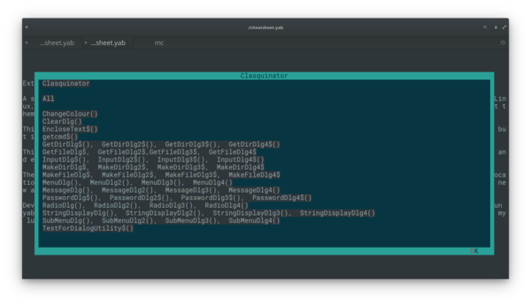

# YAB CHEATSHEET

A little utility I cooked up for myself in an afternoon, to reacquaint myself with the libraries I wrote some years back, and to have a handy reference when I'm working with them. You are welcome to look at the code and see how I use my libraries.

It requires Brett Terpstra's *mdless* utility . get it at [https://brettterpstra.com/projects/mdless/](https://brettterpstra.com/projects/mdless/).

It also requires that the README.md file in each library directory be symlinked to this app's directory. Also symlink clasquinatorlib.yab and linuxmisclib.yab here if they are not in your systems library path.

cheatsheet.yab needs to be started from the directory where it all those data files are.

