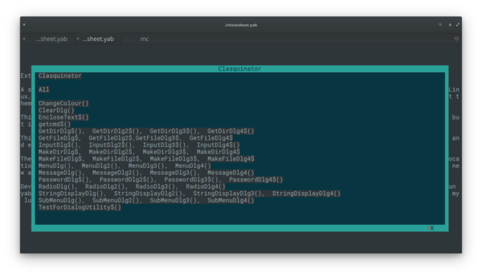

# YAB CHEATSHEET V2

A little utility I cooked up for myself in an afternoon, to reacquaint myself with the libraries I wrote some years back, and to have a handy reference when I'm working with them. You are welcome to look at the code and see how I use my libraries.

It requires Brett Terpstra's *mdless* utility . get it at [https://brettterpstra.com/projects/mdless/](https://brettterpstra.com/projects/mdless/).

Version 1 required that the README.md file in each library directory be symlinked to this app's directory. It also needs to be started from the directory where it all those data files are.

Version 2 reflects my distaste for hard-coded paths and files scattered all over the place and attempts to bring it all into one big executable file, or at least one script. I can't help myself, I love genreating the required files from DATA statements.

The program now also checks if the mdless utility is installed and will throw up a warning if it is not, then continue on with reduced abilities.

