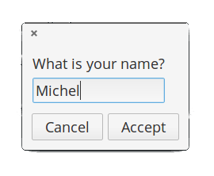
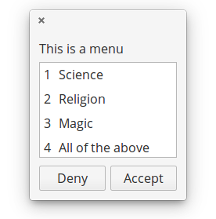
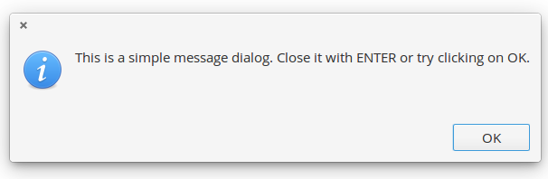
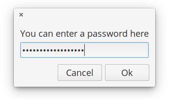
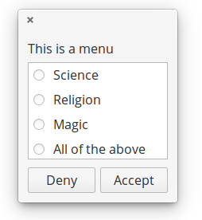
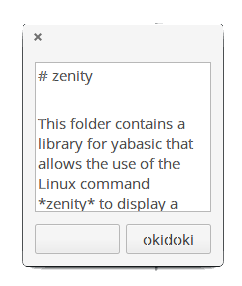
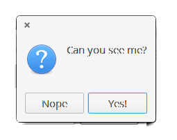
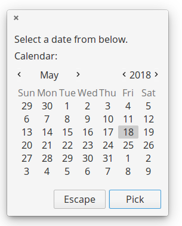

# zenity

This folder contains a library for yabasic that allows the use of the Linux command *zenity* to display a variety of dialogs in graphical mode.

The library will test for the presence of the zenity command and will exit gracefully if it is not present.Zenity is a GTK program, so the colours and styles will follow that of your GNOME defaults. It may also take a moment or two to pop up - there are a lot of libraries to load! If speed is of the essence, stick to the *dialog* or *whiptail* libraries.

The entire set of libraries focuses on sane defaults and getting basic functionality into yabasic. There are a lot of options that will not be implemented!

The images below are for illustration only. The exact appearance of the dialogs will depend on your system settings.

Developed on elementary OS 0.4 "Loki" (i.e. Linux), but it should work on any system that will run both yabasic and the zenity command.

The library should exist either in the same folder as your program or in the standard yabasic library location on your system.

To use the library, use the command

    import zenitylib

You should **not** use this library and one of the others that provides dialogs in this set concurrently, because they replicate subroutine names. Pick the right one for your program and stick with it!

## Routines available:

### Common Routines

**These routines are available on any of the four dialog-providing libraries.**

+ **ClearDlg**() - on dialog and whiptail, this clears the dialog from your terminal. Same as the yabasic command CLEAR SCREEN, but may work better if you are expecting to issue another Linux command immediately. On zenity and kdialog, dummy routines are provided for compatibility so that you do not need to rewrite your code.

+ **EncloseText$**(thestring$) - A simplified version of the *EncloseString$*() routine that can be found in the linuxmisclib library
    + Encloses a string in double quotes, if it isn't already.
    + Therefore *a$ = EncloseText$("This is text")* gives the same result as *a$ = "\"This is text\""*
    + Mostly for use with text strings that may include spaces.
    + Not required in clasquinator, where only a dummy routine is provided for compatibility.

+ **getcmd$**() - returns the command set available.
    + This is really just for me, to stop me from getting confused while I am editing four libraries simultaneously. 
    + However, you could use it to test which utility (or library, in the case of clasquinator) is currently in use and if it is safe to use routines not in the common list.
    + e.g, *if getcmd$() = "clasquinator" SubmenuDlg(options ....)*
    + or  *if getcmd$() = "zenity" ZNotifyDlg("this is a notification")*

+ **InputDlg$**(text$, title$, ok$, cancel$) - Presents a one-line dialog into which the user can type a string answer.
    + The value *title$* has no effect in zenity but is kept here for compatibility and must be supplied.
    + The value *ok$* is the text of the accept button, normally OK.
    + The value *cancel$* is the text of the reject button, normally Cancel.
    + The result is returned as a string value.
    + *Example:*
```
a$ = InputDlg$(EncloseText$("What is your name?"), EncloseText$("Who are you?"), "Accept", "Cancel")
```


+ **MenuDlg**(text$, title$, ok$, cancel$, menustring$) - Create a menu of options for the user to choose from
    + The value *title$* has no effect in zenity, but is kept here for compatibility and must be supplied.
    + The value *ok$* is the text of the accept button, normally OK.
    + The value *cancel$* is the text of the reject button, normally Cancel.
    + The value menustring$ is the list of menu options as a single string, separated by hash signs (#). Spaces are allowed.
    + If the number of options exceed the available space in the widget, the list will be scrollable.
    + The result is returned as a numeric value, starting from 1.
   + If you prefer to get the same number in string format, you can use **MenuDlg$**(text$, title$, ok$, cancel$, menustring$)
   + Please note that the height of this widget is hardcoded at 400 pixels, because it looked really crap when allowed to autosize. This may change with future releases of zenity.
   + *EXAMPLE: a = MenuDlg("This is a menu", "A Menu!","Accept", "Deny", "Science#Religion#Magic#All of the above"): print a*



+ **MessageDlg**(text$) - display a simple message with an OK button.
    + Returns nothing.
   + *Example:*
```
MessageDlg(EncloseText$("This is a simple message dialog. Close it with ENTER or try clicking on OK."),"OK")
```


+ **PasswordDlg$**(text$, title$, ok$, cancel$) - Same as *InputDlg$* but with asterisks replacing the input text.
    + The value *title$* has no effect in zenity, but is kept here for compatibility and must be supplied.
    + The value *ok$* is the text of the accept button, normally OK
    + The value *cancel$* is the text of the reject button, normally Cancel
    + The result is returned as a string value.



+ **RadioDlg**(text$, title$, ok$, cancel$, menustring$, selected$) - Create a menu of options for the user to choose from
    + Same as *MenuDlg*(), except that radiobuttons are presented in the first column. Unlike the other dialog-creating utilities, you cannot choose which one to pre-select.
    + The value *title$* has no effect in zenity, but is kept here for compatibility and must be supplied.
    + The value *ok$* is the text of the accept button, normally OK.
    + The value *cancel$* is the text of the reject button, normally Cancel.
    + The value *menustring$* is the list of menu options as a single string, separated by hash signs (#). Spaces are allowed.
    + The value *selected$* has no effect in zenity, but is kept here for compatibility and must be supplied.
    + If the number of options exceed the available space in the widget, the list will be scrollable.
    + The result is returned as a numeric value, starting from 1.
    + If you prefer to get the same number in string format, you can use **RadioDlg$**(text$, title$, ok$, cancel$, menustring$, selected$)
    + *EXAMPLE: a = RadioDlg("This is a menu", "A Menu!","Accept", "Deny", "Science#Religion#Magic#All of the above", "Magic"): print a*



+ **TestForDialogUtility\$**\(\) - Routine to test if the called utility actually exists on the system. An empty string returned means it does, otherwise an error message is returned.

+ **TextFileDlg**(filename$, title$, exit$) - Displays a text file.
    + The value *title$* has no effect on zenity, but is used here for compatibility reasons and must be supplied.
    + The value *exit$* is the title of the button, normally "OK"
    + Text wrapping varies from one dialog-provider to the next. It is better if you preformat your text file.
    + Returns nothing.



+ **YesNoDlg**(text$,yes$, no$) - Displays a dialog with text (normally a question) and the options to reply yes or no.
    + in *dialog*, the first CAPITAL letter of the yes$ and no$ variables will become the hotkeys for those buttons, so make sure they are different. This does not matter for the other dialog-providing utilities.
    + Returns 1 for yes and 0 for no.




### Zenity-specific routines

**These routines will only work with zenity, unless specified otherwise.**

+ **ZCalendarDlg$**(text$, ok$, cancel$) - Display a calendar widget with today's date pre-selected.
    + Use TAB and SHFT-TAB to move between the fields.
    + The value *ok$* is the text of the accept button, normally OK.
    + The value *cancel$* is the text of the reject button, normally Cancel.
    + The value *text$* has no effect on zenity, but is used here for compatibility reasons and must be supplied.
    + On exit, the date is returned in the form dd/mm/yyy, e.g. 23/05/2018
    + ONLY available in Zenity. - for dialog and kdialog, see DCalendarDlg$() and KCalendarDlg$()
    + DCalendarDlg$ and ZCalendarDlg$ are fully compatible.
    + *EXAMPLE: print ZCalendarDlg$("\"Pick a date\"", "Pick", "Escape")*



+ **ZNotifyDlg**(text$) - pop up a GTK notification.
    + The exact placement and duration of notifications may depend on your WM settings.
    + ONLY available in Zenity. If you need a general utility, try *NotifyDlg()* in the *linuxmisclib* library.
